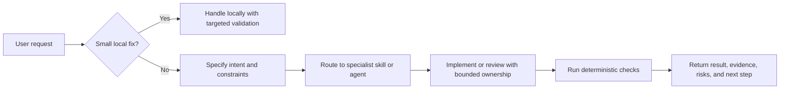

# SWE Harness

Software Engineering (SWE) Harness is a portable agent-harness package for
people who want a production-grade coding-assistant operating loop in Codex or
Claude Code.

It packages reusable skills, specialized agents, Model Context Protocol (MCP)
guidance, install templates, and safety checks. The goal is not to make an
agent louder. The goal is to make the work loop clearer: understand the code,
shape the spec, delegate bounded work, verify with evidence, and avoid leaking
private configuration.



## What Is Included

- A Codex plugin at `plugins/swe-harness/` with `.codex-plugin/plugin.json`.
- A Claude Code plugin at the same path with `.claude-plugin/plugin.json`.
- A Codex marketplace catalog at `.agents/plugins/marketplace.json`.
- A Claude Code marketplace catalog at `.claude-plugin/marketplace.json`.
- Twenty reusable skills covering orchestration, code reading, testing,
  security, frontend work, Playwright, Gherkin, Google Agent Development Kit
  work, and Model Context Protocol (MCP) server design.
- Eight specialist agent definitions for architecture, development, quality and
  security, DevOps, polyglot ramp-up, user interface design, frontend building,
  and user experience auditing.
- Local install and validation scripts.

## Quick Install: Claude Code

```bash
claude plugin marketplace add andrey-learning-machines/swe-harness
claude plugin install swe-harness@swe-harness
```

For local development before a release:

```bash
claude --plugin-dir ./plugins/swe-harness
```

## Quick Install: Codex

Clone the repository, then run:

```bash
./scripts/install-codex-local.py
```

That copies `plugins/swe-harness` to `~/plugins/swe-harness` and adds a
sanitized entry to `~/.agents/plugins/marketplace.json`.

## Validate

```bash
./scripts/validate-package.sh
```

The validator checks JSON manifests, required plugin files, skill frontmatter,
secret patterns, private path leaks, and marketplace shape.

## Attribution

The Unicorn Team orchestration concept and original Claude Code plugin are by
AJ Geddes: <https://github.com/aj-geddes/unicorn-team>. This repository credits
that work in `ATTRIBUTION.md` and `NOTICE`.

## Research Basis

- Claude Code plugins use `.claude-plugin/plugin.json` and can contain
  `skills/`, `agents/`, hooks, and Model Context Protocol (MCP) configuration.
- Claude Code marketplaces are distributed from repositories with a root
  `.claude-plugin/marketplace.json`.
- Codex plugins use `plugins/<name>/.codex-plugin/plugin.json` plus optional
  companion surfaces such as `skills/`, `.app.json`, `.mcp.json`, `agents/`,
  commands, and assets.

See `docs/research.md` for links and notes.
