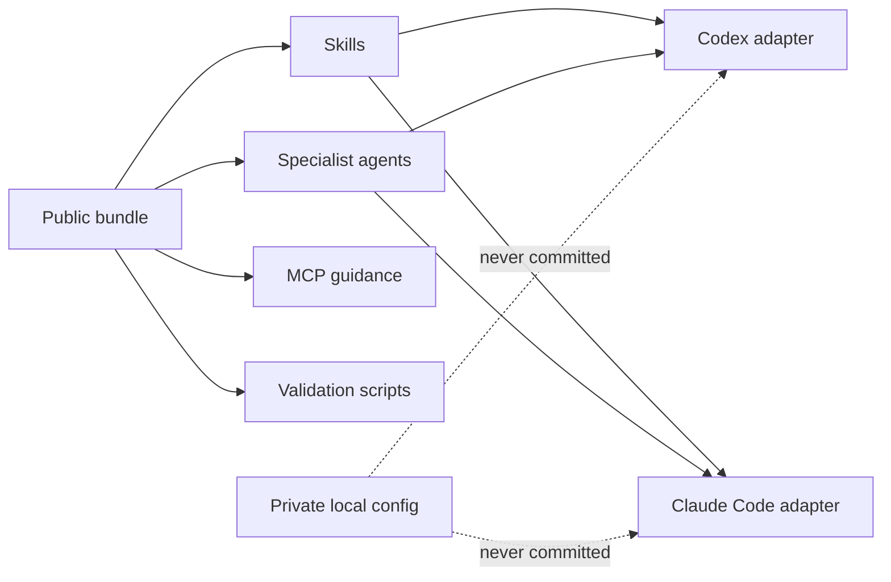

# Architecture

SWE Harness is organized as one reusable public bundle with thin host adapters.

## Boundaries

- `plugins/swe-harness/skills/` is the shared skill payload.
- `plugins/swe-harness/agents/` is the shared specialist-agent payload.
- `.agents/plugins/marketplace.json` is the Codex marketplace catalog.
- `.claude-plugin/marketplace.json` is the Claude Code marketplace catalog.
- `templates/private/` contains examples only, never rendered secrets.
- `scripts/validate-package.sh` is the release gate.

## Why One Plugin Directory?

Claude Code and Codex both support plugin roots with skills and agents. Their
manifest directories differ, but the runtime payload is similar enough to share.
Keeping one plugin root avoids drift between hosts.

## Private Configuration Rule

Private configuration is always outside the release artifact. If a user needs a
GitHub token, cloud credential, or Model Context Protocol (MCP) server secret,
they set an environment variable or local ignored file. Published files contain
placeholders only.
