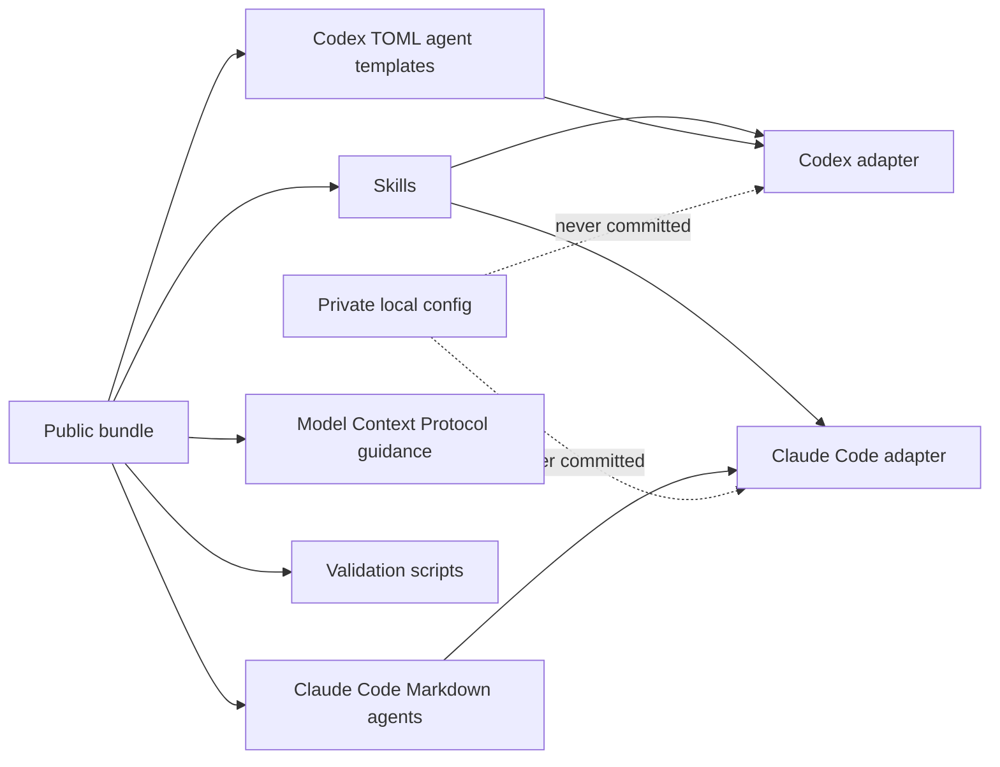

# Architecture

Software Engineering (SWE) Harness is organized as one reusable public bundle
with thin host adapters.

## Boundaries

- `plugins/swe-harness/skills/` is the shared skill payload.
- `plugins/swe-harness/agents/` is the Claude Code Markdown specialist-agent
  payload.
- `templates/codex/agents/` contains Codex TOML custom-agent templates with
  OpenAI model routing.
- `.agents/plugins/marketplace.json` is the Codex marketplace catalog.
- `.claude-plugin/marketplace.json` is the Claude Code marketplace catalog.
- `templates/private/` contains examples only, never rendered secrets.
- `scripts/validate-package.sh` is the release gate.

## Why One Plugin Directory?

Claude Code and Codex both support plugin roots with skills. Their agent
formats differ enough that the harness keeps host-specific agent metadata:
Claude Code uses Markdown agent files, while Codex uses TOML custom-agent files.
The shared behavior stays in skills and documentation so the host adapters can
choose the right model and file format without drifting in purpose.

## Private Configuration Rule

Private configuration is always outside the release artifact. If a user needs a
GitHub token, cloud credential, or Model Context Protocol (MCP) server secret,
they set an environment variable or local ignored file. Published files contain
placeholders only.
