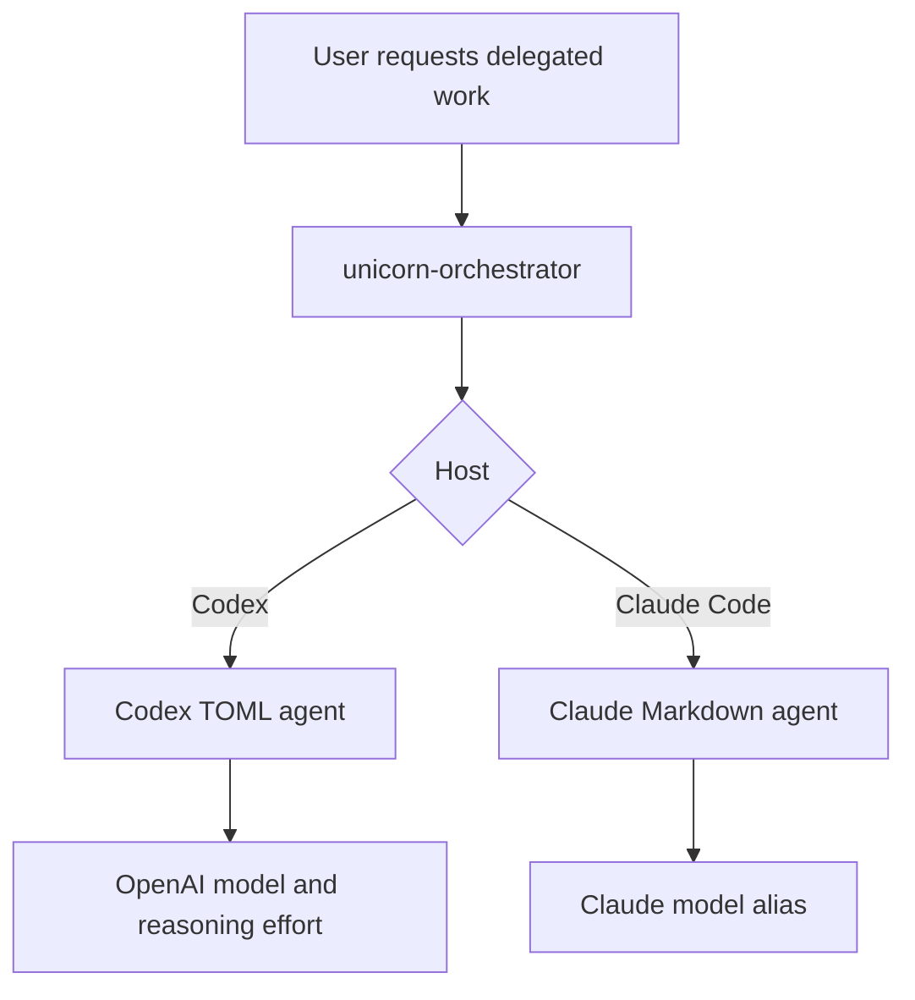

# Model Routing

This document defines the default model choices for SWE Harness agents.

Codex custom agents use Tom's Obvious Minimal Language (TOML) files in
`~/.codex/agents/` or `.codex/agents/`. Claude Code plugin agents use Markdown
files in `plugins/swe-harness/agents/`. Keep those host formats separate:
Codex agents should use OpenAI model identifiers, while Claude Code agents may
use Claude model aliases.

## Research Basis

The Codex subagents documentation says custom agents can define their own
`model` and `model_reasoning_effort`, and that custom agents live under
`~/.codex/agents/` or `.codex/agents/`.

OpenAI's Codex model guidance recommends starting most Codex tasks with
`gpt-5.5`, using `gpt-5.4-mini` for faster or lower-cost lighter coding tasks
and subagents, and reserving `gpt-5.3-codex-spark` for users who have access to
that Pro-only research preview.

Community discussion is useful as a caution signal, not as the source of truth:
users report that Codex model availability changes over time and that older
Codex-specific models may disappear from ChatGPT sign-in model pickers. Because
of that, this harness avoids older removed defaults such as `gpt-5.1-codex-max`
or `gpt-5.2-codex` in local agent templates.

References:

- <https://developers.openai.com/codex/subagents>
- <https://developers.openai.com/codex/models>
- <https://developers.openai.com/api/docs/guides/latest-model>
- <https://cookbook.openai.com/examples/gpt-5-codex_prompting_guide>
- <https://www.reddit.com/r/CodexAutomation/comments/1sfd1vj/codex_model_availability_update_chatgpt_signin/>
- <https://www.reddit.com/r/CodexAutomation/comments/1pqepre/codex_cli_updates_0740_0750_gpt52codex_new/>

## Codex Defaults

| Agent | Model | Reasoning | Rationale |
|-------|-------|-----------|-----------|
| `unicorn_architect` | `gpt-5.5` | `high` | Complex architecture, planning, tradeoffs, and long-context synthesis. |
| `unicorn_developer` | `gpt-5.5` | `high` | Core implementation, debugging, test repair, and multi-file edits. |
| `unicorn_qa_security` | `gpt-5.5` | `high` | Correctness, security, data-integrity, and regression review. |
| `unicorn_devops` | `gpt-5.4` | `high` | Infrastructure, deployment, rollback, and operations work where `gpt-5.4` is a strong professional-work default. |
| `ui_ux_designer` | `gpt-5.4` | `high` | Product design direction and visual-system reasoning. |
| `ui_frontend_builder` | `gpt-5.3-codex` | `high` | Focused coding-heavy user interface implementation. |
| `unicorn_polyglot` | `gpt-5.4-mini` | `medium` | Fast read-heavy language or framework ramp-up as a helper subagent. |
| `ux_auditor` | `gpt-5.4-mini` | `medium` | Efficient read-only user experience review and issue triage. |

## Fallback Policy

If a Codex account cannot access a configured model, choose the closest
available current OpenAI model in this order:

1. For frontier agents: `gpt-5.5`, then `gpt-5.4`, then `gpt-5.3-codex`.
2. For fast read-only agents: `gpt-5.4-mini`, then `gpt-5.4`, then
   `gpt-5.3-codex`.
3. For Pro-only real-time coding experiments, users may manually switch focused
   agents to `gpt-5.3-codex-spark`.

Do not set Codex custom agents to Anthropic aliases such as `sonnet`, `opus`,
or `haiku`.
