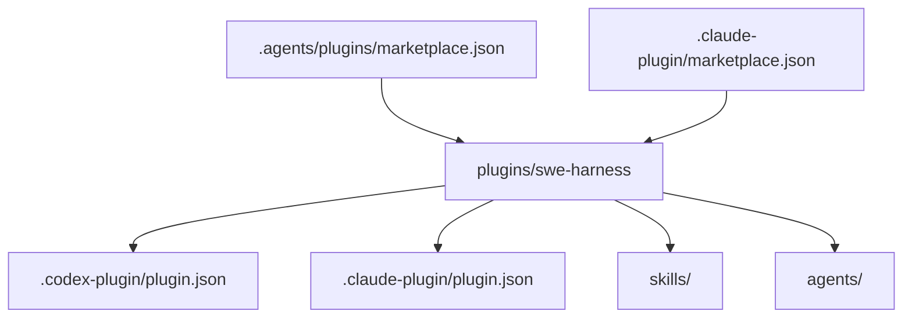

# Research Notes

This page records the host-specific packaging choices behind SWE Harness.

## Claude Code

Claude Code plugins use a plugin directory with `.claude-plugin/plugin.json`.
Plugin components such as `skills/`, `agents/`, hooks, Model Context Protocol
(MCP) servers, language server configuration, `bin/`, and default
`settings.json` live at the plugin root, not inside `.claude-plugin/`.

Claude Code marketplaces are repositories or directories with a root
`.claude-plugin/marketplace.json`. Users add them with:

```bash
claude plugin marketplace add owner/repo
```

Then users install a plugin with:

```bash
claude plugin install plugin-name@marketplace-name
```

References:

- <https://code.claude.com/docs/en/plugins>
- <https://code.claude.com/docs/en/plugin-marketplaces>
- <https://code.claude.com/docs/en/sub-agents>

## Codex

Codex plugin examples place each plugin under `plugins/<name>/` with a required
`.codex-plugin/plugin.json` manifest and optional companion surfaces such as
`skills/`, `.app.json`, `.mcp.json`, plugin-level `agents/`, commands, hooks,
assets, and supporting files.

This repository includes a repo-local Codex marketplace at:

```text
.agents/plugins/marketplace.json
```

Reference:

- <https://github.com/openai/plugins>

## Shared Design Decision

The same `plugins/swe-harness/` directory contains both host manifests. This
keeps the public bundle single-source while letting Codex and Claude Code read
the metadata shape each host expects.



## Acceptance Harness

Specification Kit (Spec Kit) provides a durable way to capture a constitution,
feature specification, plan, and tasks before implementation. SWE Harness adds a
portable acceptance layer on top: Gherkin for business-readable behavior,
Playwright for browser-visible proof, and a `story_matrix.py` ledger for route
or capability drift.

References:

- <https://github.com/github/spec-kit>
- <https://github.github.com/spec-kit/>
- <https://cucumber.io/docs/gherkin/>
- <https://playwright.dev/docs/writing-tests>

## Linear MCP

Linear provides an official remote Model Context Protocol (MCP) server. Linear
documents a Streamable Hypertext Transfer Protocol (HTTP) endpoint at
`https://mcp.linear.app/mcp`, OAuth setup for Codex and Claude Code, and a
local `mcp-remote` bridge for clients that do not support remote MCP directly.

Reference:

- <https://linear.app/docs/mcp>
