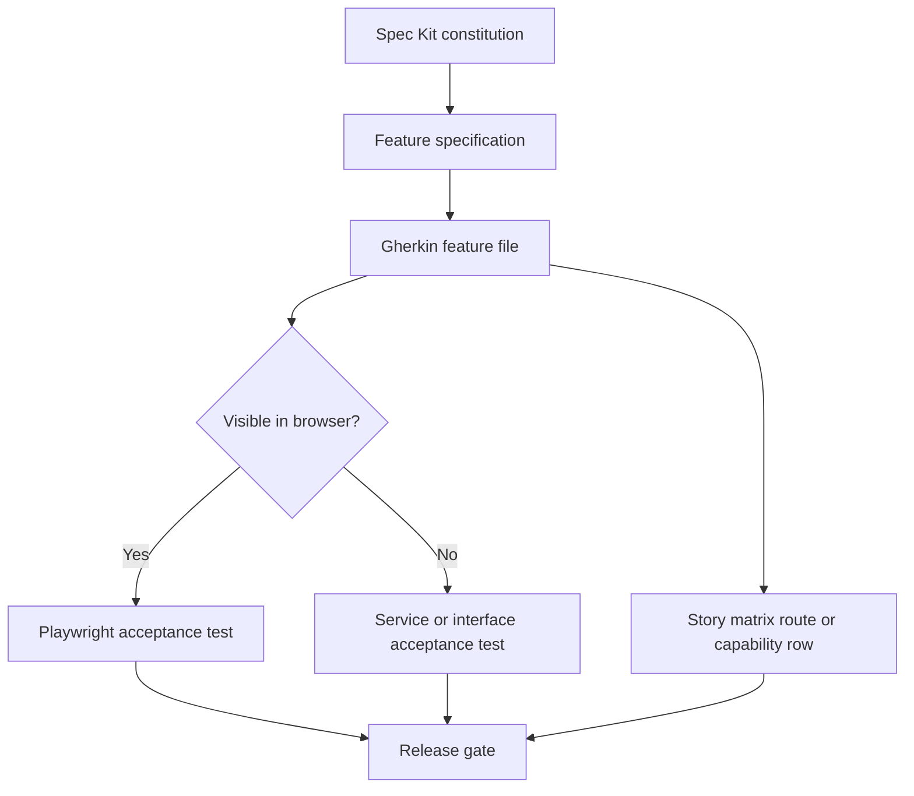

# Specification Kit To Acceptance Harness

This repository includes the Specification Kit (Spec Kit) adoption lesson as a
reusable harness pattern.

Spec Kit is useful for durable intent: feature specifications, implementation
plans, task breakdowns, and project constitutions. The missing production step
is making sure those specifications become executable acceptance proof.



## The Pattern

1. **Spec Kit constitution** captures project rules that should shape every
   non-trivial change.
2. **Feature specification** captures user stories, requirements, edge cases,
   success criteria, and assumptions.
3. **Gherkin feature file** converts the feature into business-readable
   behavior.
4. **Playwright feature acceptance test** proves browser-visible behavior end
   to end.
5. **Story matrix** maps each story to required routes, events, or capabilities
   so backend drift fails early.

In this document, Application Programming Interface (API) means a service
contract exposed through routes, handlers, events, or tool calls.

## Recommended Repository Layout

```text
specs/
  001-feature-name/
    spec.md
    plan.md
    tasks.md
tests/
  features/
    feature-name.feature
  acceptance/
    feature-name.spec.ts
  harness/
    story_matrix.py
```

## Acceptance Contract

Every medium or large feature should answer:

| Question | Artifact |
|----------|----------|
| What did the user ask for? | Spec Kit `spec.md` |
| What behavior should exist? | Gherkin `.feature` |
| What browser path proves it? | Playwright `.spec.ts` |
| What backend or service surface must exist? | `story_matrix.py` |
| What command fails on drift? | release or preflight script |

## Example Commands

```bash
python -m pytest tests/harness/test_story_matrix.py -q
npx playwright test tests/acceptance/feature-name.spec.ts
```

If your project uses a full preflight script, wire both checks into that gate.

## Spec Kit Branch Note

Spec Kit generated scripts commonly expect numbered feature branches such as
`001-feature-name`. If a host tool requires its own branch prefix, use a shape
such as `codex/001-feature-name` when the tool supports a single ignored path
segment, or pass the feature explicitly through the host-supported environment
variable. For GitHub Spec Kit scripts, that variable is commonly
`SPECIFY_FEATURE`.

## Templates

Reusable templates live under `templates/harness/`:

- `feature.feature.example`
- `playwright.acceptance.spec.ts.example`
- `story_matrix.py.example`
