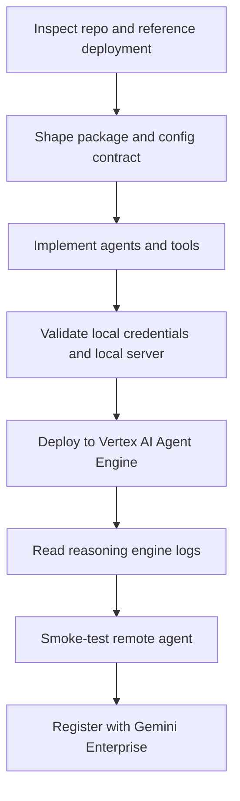

# ADK Agent Engine

## Overview

Build Python Google Agent Development Kit (ADK) agents for Vertex AI Agent Engine and hand them off cleanly to Gemini Enterprise.
Prefer source-based deployment, custom retrieval tools, and explicit local-versus-runtime configuration boundaries.

## Workflow Map

## 1. Start with the deployment model

- Prefer Python for Agent Engine deployment.
- Prefer source-based Agent Engine deployment over local object serialization when the codebase is a real app.
- Inspect any reference repository the user names before changing the deployment flow.
- Mirror the working reference deployment shape:
  - Use `source_packages`.
  - Use `entrypoint_module`.
  - Use `entrypoint_object`.
  - Use a runtime env file such as `envs/prod.env`.
  - Generate a requirements file that is relative to the uploaded source package.
- Keep `root_agent` as the top-level front door when the user wants one greeter agent plus domain sub-agents.

## 2. Use a stable package layout

- Prefer a top-level importable package such as `my_agent/` for deployed code.
- Use `agent.py` to export the root agent.
- Use `agent_engine_app.py` to export the Agent Engine app object.
- Keep agent definitions in `agents/`.
- Keep custom tools in `tools/`.
- Keep deployment and registration entrypoints in `scripts/`.
- If local ADK discovery wants a narrower directory than the deployed package layout, use a thin local shim rather than changing the deployed package to fit local discovery.

## 3. Keep local and runtime configuration separate

- Use a local `.env` for development-only values:
  - service account key path
  - Google Cloud project id
  - display names
  - local registration defaults
- Use a runtime env file such as `envs/prod.env` for Agent Engine runtime variables only.
- Never pass these local-only values into Agent Engine runtime env vars:
  - `GOOGLE_APPLICATION_CREDENTIALS`
  - `GOOGLE_CLOUD_PROJECT`
  - `GOOGLE_CLOUD_LOCATION`
- Prefer this split:
  - local `.env`: local credentials and operator defaults
  - runtime env file: model and retrieval settings needed by the running service

## 4. Prefer a custom retrieval tool for document-grounded agents

- Use a custom function tool when the agent must query Discovery Engine or Vertex AI Search and normalize results.
- Keep tool output small and citation-ready.
- Return fields like:
  - `title`
  - `uri`
  - `snippet`
  - `chunk_text`
  - `source_id`
  - `score`
- Return machine-readable failure states so the agent can abstain instead of inventing.
- Make the document specialist call the retrieval tool before any substantive answer.

## 5. Use the correct serving configuration for Enterprise retrieval

- Prefer an engine or app serving configuration path when Enterprise extractive answers or segments are needed.
- Do not assume a raw datastore serving configuration path is enough.
- If the Search API returns a precondition error about Enterprise features, switch to the engine or app serving configuration immediately.
- Treat this as a common integration bug, not a model issue.

## 6. Validate locally before deploying

- Verify Application Default Credentials (ADC) first.
- Use a short Python check with `google.auth.default(...)` to confirm:
  - project id
  - service account email
  - credential type
- Validate the retrieval path before involving the language model:
  - list data stores or engines if needed
  - run a direct search request
  - confirm the serving configuration actually returns results
- Start a local ADK server through a wrapper script that loads `.env` safely.
- Smoke-test both:
  - a greeting routed only by the root agent
  - a domain question that triggers the specialist agent and the retrieval tool

## 7. Deploy the same way the working reference repo deploys

- Change into the project root before creating the Agent Engine config.
- Pass `source_packages` as relative package names, not absolute paths.
- Generate the requirements file inside the uploaded source package.
- Pass `requirements_file` as a path relative to the source root included in the upload.
- Write deployment metadata after a successful create or update so later registration steps can reuse the resource id.

## 8. Read logs before guessing

- Read reasoning engine build logs when packaging or dependency installation is suspect.
- Read reasoning engine stdout and stderr when startup fails.
- Look for exact module import failures.
- Treat these failure patterns as high-signal:
  - `No module named '<your package>'`: source archive layout is wrong.
  - `No module named 'vertexai'`: requirements file was not included or not installed from the uploaded source tree.
  - precondition error for Enterprise features: serving configuration points at the wrong resource type.
- Fix the packaging or config issue first, then redeploy. Do not paper over it with prompt changes.

## 9. Smoke-test the deployed agent

- Use the deployed Agent Engine resource id from deployment metadata or env.
- Create a remote session first.
- Run at least two remote checks:
  - greeting
  - document question that should call the retrieval tool
- Confirm the remote answer shows the expected routing behavior and sources.
- Treat a successful deploy without a remote query as incomplete verification.

## 10. Hand off registration cleanly

- Prefer the same registration command shape the reference repo uses when the team expects it.
- If the reference repo uses `uvx agent-starter-pack ... register-gemini-enterprise`, mirror that in the local `Makefile`.
- Keep a repo-local fallback script available only as a backup path.
- Confirm these values before registration:
  - Gemini Enterprise app id
  - Agent Engine resource id
  - display name
  - description

## 11. Use these defaults unless the repo says otherwise

- Use one root greeter or guardrail agent and specialized sub-agents for future domains.
- Use custom retrieval tools instead of checkpoint databases or custom memory backends unless the user asks for persistence.
- Keep deployment scripts versioned inside the repo.
- Keep the first version minimal and source-grounded before adding extra telemetry, memory, or authorization layers.

## Read These References When Needed

- Read `references/checklists.md` for preflight, deploy, and remote test checklists.
- Read `references/common-failures.md` when deployment succeeds at create time but fails during runtime startup or retrieval.
