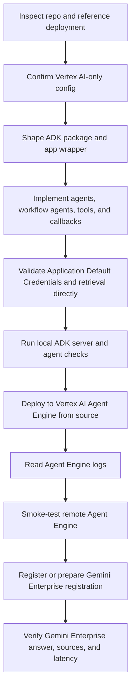

# ADK Vertex Gen AI

## Operating Stance

Build Python Google Agent Development Kit (ADK) agents for Vertex AI Agent Engine and Gemini Enterprise. Treat Vertex AI as the production control plane and runtime target; do not use Google Developers Gemini Application Programming Interface (API) key patterns for this workflow.

Use this skill when work touches any of these areas:

- ADK `LlmAgent`, `SequentialAgent`, `ParallelAgent`, callbacks, tools, evaluation, or local ADK servers.
- Vertex AI Agent Engine source-based deployment, runtime service accounts, logs, or remote smoke tests.
- Google Gen AI Software Development Kit (SDK) calls through Vertex AI, especially `Part.from_uri` document understanding.
- Discovery Engine or Vertex AI Search retrieval tools, signed source links, and citation formatting.
- Gemini Enterprise registration of deployed ADK agents.

## Workflow Map



## Core Rules

- Prefer source-based Vertex AI Agent Engine deployment for real repos. Use `source_packages`, `entrypoint_module`, `entrypoint_object`, generated requirements, and deployment metadata.
- Export `root_agent` from an importable package and wrap it with `AdkApp(agent=root_agent)` for Agent Engine.
- Separate local operator configuration from runtime configuration. Local files can include service account key paths; Agent Engine runtime environment variables must not include `GOOGLE_APPLICATION_CREDENTIALS`, `GOOGLE_CLOUD_PROJECT`, or local Gemini Enterprise registration variables.
- Use custom function tools for controlled retrieval, full-document inspection, signed links, and normalized citations. Prefer custom tools when built-in tool limitations or output shape matter.
- Use callbacks when behavior belongs around a model or tool boundary: normalize tool output, collect source state, add final citations, enforce markdown shape, or hide intermediate workflow output.
- Read logs and run remote queries before declaring a deployment complete.

## Vertex AI Gen AI SDK Rules

The Google Gen AI SDK must run in Vertex AI mode for this workflow.

- Preferred explicit client:

```python
from google import genai
from google.genai import types

client = genai.Client(
    vertexai=True,
    project=project_id,
    location="global",
    http_options=types.HttpOptions(api_version="v1"),
)
```

- Environment-variable mode is acceptable only if it is clearly Vertex AI mode: `GOOGLE_GENAI_USE_VERTEXAI=True`, `GOOGLE_CLOUD_PROJECT`, and `GOOGLE_CLOUD_LOCATION`.
- Do not use `GOOGLE_API_KEY`, Google AI Studio key flows, or non-Vertex Gemini Developer API clients for Agent Engine production agents.
- Use `types.Part.from_uri(file_uri="gs://...", mime_type="application/pdf")` for Cloud Storage document understanding when the runtime service account has object read access.
- Use `global` for Gemini 3 preview model endpoints unless a current official model page says otherwise. Note in the plan that Gemini 3 models are preview if the official model page says preview.
- Keep model settings configurable: primary agent model, document-understanding model, location, output token limits, media resolution, and thinking level.

## Agent Design Rules

- Keep the root agent as the front door when future domain expansion is likely. Its job is greeting, capability explanation, high-level guardrails, and delegation.
- Put domain retrieval and policy answering in specialized sub-agents.
- For deep-research behavior, use a sequential-into-parallel-into-synthesis pattern:
  - planner decomposes the question,
  - parallel research agents call retrieval and document tools,
  - synthesizer produces the only final user-visible answer,
  - callback or workflow wrapper suppresses intermediate text while preserving tool events and state deltas.
- If a workflow wrapper hides intermediate emissions, never drop function-call or function-response events. Those events are needed for ADK state and tool execution.
- All grounded-answer agents must abstain when retrieval or document evidence is insufficient.
- Final answers from document agents should cite distinct sources once, preserve markdown, and use valid markdown links.

## Deployment Rules

- Inspect any reference repo the user names before changing deployment commands. Mirror the working `make deploy` and `make register-gemini-enterprise` shape when the team expects that interface.
- Change into repo root before packaging.
- Put generated requirements inside the uploaded source package and pass `requirements_file` relative to the uploaded source root.
- Pin or constrain core dependencies enough for repeatable Agent Engine builds: `google-cloud-aiplatform[agent_engines,adk]`, `google-adk`, `google-genai`, `google-cloud-discoveryengine`, `google-cloud-storage`, and any framework-specific packages.
- Use a dedicated runtime service account. Grant minimum practical roles for the actual tools: Agent Engine runtime invocation, Discovery Engine or Vertex AI Search read/search, Cloud Storage object read, and Service Account Token Creator only if signing URLs through Identity and Access Management (IAM) credentials.
- Write `deployment_metadata.json` after successful create or update.

## Verification Rules

- Validate Application Default Credentials (ADC) locally before agent tests.
- Test retrieval and full-document tools directly before prompt debugging.
- Start a local ADK server and test at least one greeting plus one retrieval-backed question.
- After deploy, create a remote session and stream-query the deployed Agent Engine resource.
- Benchmark latency and quality when changing model families, thinking levels, document reads, or parallel lane count.
- For Gemini Enterprise, test the rendered output, not just the raw Agent Engine stream. Broken markdown can be invisible locally but ugly in Enterprise.

## Reference Files

- Read `references/checklists.md` before implementation, deployment, and handoff.
- Read `references/common-failures.md` when local, deployment, retrieval, document, signed-link, or Gemini Enterprise behavior breaks.
- Read `references/vertex-genai-patterns.md` for Vertex AI Gen AI SDK code patterns, document-understanding tools, callbacks, and deep-research workflow guidance.

## Official References

- ADK overview: https://adk.dev/get-started/about/
- ADK agents: https://adk.dev/agents/
- ADK sequential workflow agents: https://adk.dev/agents/workflow-agents/sequential-agents/
- ADK parallel workflow agents: https://adk.dev/agents/workflow-agents/parallel-agents/
- ADK callbacks: https://adk.dev/callbacks/
- ADK tool limitations: https://adk.dev/tools/limitations/
- ADK evaluation criteria: https://adk.dev/evaluate/criteria/
- Vertex AI Agent Engine deployment: https://docs.cloud.google.com/vertex-ai/generative-ai/docs/agent-engine/deploy
- Gemini Enterprise ADK registration: https://docs.cloud.google.com/gemini/enterprise/docs/register-and-manage-an-adk-agent
- Agent Starter Pack deployment: https://googlecloudplatform.github.io/agent-starter-pack/guide/deployment.html
- Agent Starter Pack Gemini Enterprise registration command: https://googlecloudplatform.github.io/agent-starter-pack/cli/register_gemini_enterprise.html
- Vertex AI Gen AI SDK overview: https://docs.cloud.google.com/vertex-ai/generative-ai/docs/sdks/overview
- Vertex AI document understanding with `Part.from_uri`: https://docs.cloud.google.com/vertex-ai/generative-ai/docs/multimodal/document-understanding
- Vertex AI model versions: https://docs.cloud.google.com/vertex-ai/generative-ai/docs/learn/model-versions
- Vertex AI deployments and endpoints: https://docs.cloud.google.com/vertex-ai/generative-ai/docs/learn/locations
