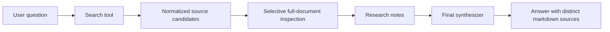
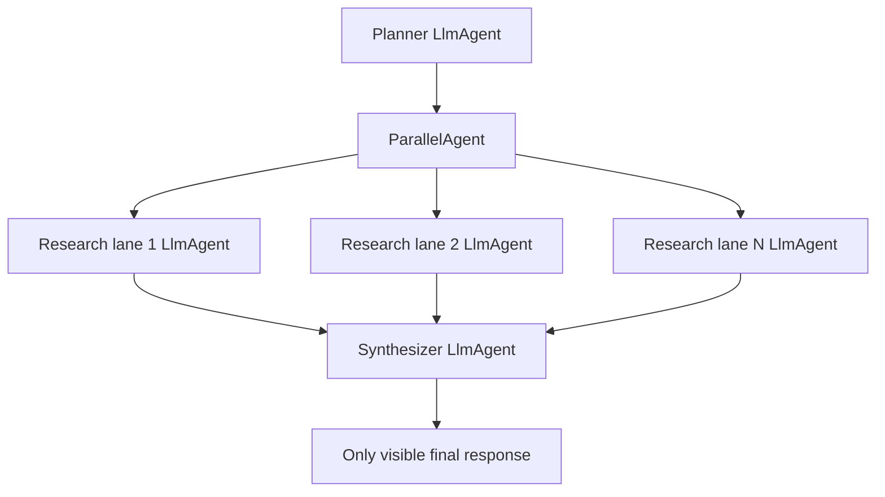

# Vertex AI Gen AI Patterns For ADK Agent Engine

This reference captures implementation patterns for Google Agent Development Kit (ADK) agents that use Vertex AI Agent Engine and the Google Gen AI Software Development Kit (SDK). These patterns are intentionally Vertex AI-first, not Google Developers Gemini Application Programming Interface (API)-first.

## Vertex AI Gen AI Client

Use explicit Vertex AI mode in production code:

```python
from google import genai
from google.genai import types

client = genai.Client(
    vertexai=True,
    project=project_id,
    location=model_location,
    http_options=types.HttpOptions(api_version="v1"),
)
```

Environment-variable mode is acceptable for simple scripts:

```bash
export GOOGLE_GENAI_USE_VERTEXAI=True
export GOOGLE_CLOUD_PROJECT="my-project"
export GOOGLE_CLOUD_LOCATION="global"
```

Avoid `GOOGLE_API_KEY` for Vertex AI Agent Engine production agents. Agent Engine should use the runtime service account and Google Cloud permissions.

## Full-Document Inspection Tool

Use retrieval first, then inspect selected Cloud Storage documents with `Part.from_uri`:

```python
from google.genai import types

document_part = types.Part.from_uri(
    file_uri="gs://bucket/path/document.pdf",
    mime_type="application/pdf",
)

response = client.models.generate_content(
    model=document_model,
    contents=[document_part, prompt],
    config=types.GenerateContentConfig(
        temperature=0.1,
        max_output_tokens=4096,
        media_resolution=types.PartMediaResolutionLevel.MEDIA_RESOLUTION_MEDIUM,
        thinking_config=types.ThinkingConfig(
            thinking_level=types.ThinkingLevel.LOW,
        ),
    ),
)
```

Tool contract:

- Validate `uri` and `question`.
- Infer and validate the Multipurpose Internet Mail Extensions (MIME) type.
- Support only known-safe document types such as Portable Document Format (PDF) and `text/plain` unless the current model page supports more and the repo explicitly allows them.
- Enforce a bucket allow-list when the datastore corpus is known.
- Return structured success and structured failure; do not raise raw model errors into the agent prompt.
- Include `model` and `location` in tool output for debugging.

## Retrieval To Document-Inspection Flow

Use this pattern for grounded answers:



Rules:

- Retrieval is the first grounding step.
- Full-document inspection is a second pass for top relevant documents only.
- Do not inspect every result blindly; it destroys latency.
- Keep the original `gs://` URI, title, and source id alongside any signed URL.
- If document inspection fails, preserve the search snippet and error state so the synthesizer can explain uncertainty.

## Deep-Research Workflow

Use a sequential-into-parallel workflow:



Implementation notes:

- Planner emits structured subqueries and a decision for how many lanes to use.
- Research lanes get the same tool set but different subqueries.
- Synthesis must combine all state and source records.
- If a lane has no useful evidence, it should say so in state, not invent.
- Use Flash models for parallel lanes when latency matters, then benchmark against Pro quality.
- Use a separate document-understanding model setting so document reads can be tuned independently from chat agents.

## Callback Patterns

Use ADK callbacks for boundary behavior:

- `after_tool_callback`: normalize tool results, sign source links, and update canonical source state.
- `after_model_callback`: append final sources, clean duplicate sources, enforce markdown, and record finish reasons.
- `before_model_callback`: trim oversized state before synthesis or block unsafe requests when simple prompt guardrails are insufficient.

For Gemini Enterprise, avoid leaking intermediate research text:

- Hide non-final text events from planner and research agents.
- Preserve function-call and function-response events.
- Preserve state deltas so callbacks and later agents still see source state.
- Validate rendered output in Gemini Enterprise after deployment.

## Signed Source Links

The safest source-link state shape is:

```python
{
    "source_id": "canonical-document-id",
    "title": "Document title",
    "canonical_uri": "gs://bucket/path/document.pdf",
    "display_url": "https://storage.googleapis.com/...",
    "score": 0.73,
}
```

Rules:

- Deduplicate on `source_id` or `canonical_uri`, not `display_url`.
- Generate signed URLs late, ideally after deduplication.
- Render as `[Document title](https://signed-url...)`.
- Do not wrap signed URLs in angle brackets unless the target renderer has been tested.
- Keep signed URLs out of test snapshots where possible; assert link shape and canonical source identity instead.

## Source-Based Agent Engine Deployment

Use source deployment for real repos:

```python
remote_agent = client.agent_engines.create(
    config={
        "source_packages": ["my_agent"],
        "entrypoint_module": "my_agent.agent_engine_app",
        "entrypoint_object": "agent_engine",
        "class_methods": class_methods,
        "requirements_file": "my_agent/requirements-agent-engine.txt",
        "display_name": display_name,
        "description": description,
        "env_vars": runtime_env,
        "service_account": runtime_service_account,
    }
)
```

Checklist:

- Generate requirements into the uploaded package.
- Keep source package paths relative.
- Resolve the entrypoint object locally before deploy.
- Filter local-only env vars out of `runtime_env`.
- Write deployment metadata for registration.

## Model And Latency Experiments

When optimizing runtime, change one variable at a time:

- Primary agent model.
- Research-lane model.
- Document-understanding model.
- Thinking level.
- Parallel lane count.
- Maximum full-document reads.
- Final synthesis token budget.

Record:

- Question.
- Model settings.
- Remote or local target.
- Latency.
- Whether retrieval ran.
- Whether full-document inspection ran.
- Whether citations were complete.
- Whether answer quality changed.

If a faster configuration appears equivalent, keep the faster setting but add a regression test for a hard, citation-heavy question.
