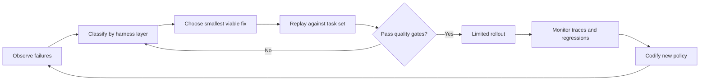

# Harness Improvement

## Overview

Use this skill to improve the whole operating loop around a coding assistant, not
only the prompt. A harness includes instructions, tools, permissions, execution
environment, memory, observability, evaluation, human checkpoints, rollout, and
rollback.

Prefer the smallest reliable improvement first. Improve instructions before
orchestration, tool contracts before new tools, and deterministic checks before
model-based graders.

## Core Workflow

1. Map the harness boundary: what the agent can read, write, execute, remember,
   call, publish, and escalate.
2. Inventory the operating loop: instructions, tool contracts, permissions,
   sandboxing, dependency setup, hooks, transcript capture, evaluation path,
   rollout path, and rollback path.
3. Classify observed failures by layer: instruction, tool, context, environment,
   approval policy, evaluation, observability, or operator workflow.
4. Recommend the smallest viable fix with an owner, expected benefit, risk, and
   rollback trigger.
5. Define replayable validation: task set, clean starting state, graders, pass
   thresholds, latency and cost budget, and failure slices.
6. Produce a compact handoff: current behavior, gap, root cause hypothesis,
   proposed change, validation command or scenario, and rollback plan.

## Reference Loading

Load only the references needed for the task:

- `references/harness-review-checklist.md`: use for audits, gap analyses, and
  production-readiness reviews.
- `references/failure-taxonomy.md`: use when debugging recurring agent failures
  or deciding whether a prompt, tool, environment, or evaluation fix is needed.
- `references/tool-contract-patterns.md`: use when designing commands, tools,
  shell permissions, file editing rules, or destructive-action safeguards.
- `references/eval-design-for-agents.md`: use when creating evaluation tasks,
  transcript or state graders, replay suites, and regression gates.
- `references/rollout-and-rollback.md`: use when planning how a harness change
  reaches real users safely.
- `references/adapter-claude-code.md`: use only for Claude Code-specific mapping
  such as `CLAUDE.md`, `.claude/settings.json`, hooks, subagents, and slash
  commands.

## Quality Gates

- Reproducibility: the same task can be replayed from a clean environment with
  the same permissions and comparable results.
- Observability: runs capture transcript, tool calls, errors, artifacts, basic
  timing, and cost-relevant counts.
- Tool safety: high-risk tools have explicit boundaries, preconditions, examples,
  useful failure messages, and friction for destructive actions.
- Data safety: secrets, personal data, and protected files are denied or redacted
  before the agent can read or emit them.
- Evaluation: success is measured by product outcome, tests, state checks, tool
  checks, or transcript checks, not only final prose quality.
- Release publication claims: before saying a package version is published or
  installable, verify the release trigger exists, the publish workflow completed
  successfully, and the artifact is resolvable from the target registry with a
  clean package-index or dry-run install check. If any check is missing, report
  the exact state instead, such as "merged but not tagged" or "tagged but not
  published."
- Rollout: every harness change has a limited rollout stage, owner, stop
  condition, and rollback action.

## Output Shape

When using this skill, return:

- Harness boundary and assumptions.
- Current assets already present.
- Gap analysis by harness layer.
- Top risks, ordered by likely user impact.
- Improvements grouped as now, next, later.
- Validation plan and rollback trigger for each high-priority change.
