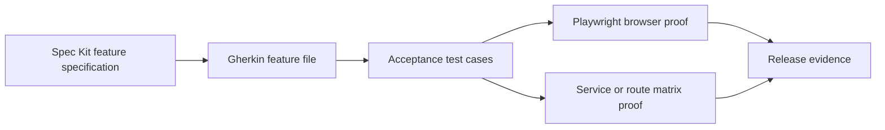

# Spec Acceptance Harness

Use this skill when a feature needs traceability from product intent to
executable proof.

This workflow connects four layers:

- **Specification**: a durable feature document, often from Specification Kit
  (Spec Kit).
- **Gherkin**: a business-readable `.feature` file with `Given`, `When`, and
  `Then` scenarios.
- **Feature acceptance tests**: browser or service checks that prove the
  behavior from a user perspective. Use Playwright when the behavior is visible
  in a web user interface.
- **Story matrix**: a small route or capability ledger, commonly named
  `story_matrix.py`, that fails when a required backend or service surface
  disappears.

## Workflow

1. Start from the feature specification.
   - Identify user stories, success criteria, edge cases, and non-goals.
   - Mark any unresolved product or authorization ambiguity before planning
     tests.
2. Write or update the Gherkin feature file.
   - Keep scenarios business-facing.
   - Avoid implementation details in the scenario text.
   - Each scenario should describe one observable behavior.
3. Map each scenario to proof.
   - Use Playwright for browser-visible behavior.
   - Use Application Programming Interface (API) or service tests for behavior
     that has no meaningful browser surface.
   - Use the story matrix for required route, event, or capability presence.
4. Add the story matrix entry before or with implementation.
   - Record story id, required route or capability, method, owning surface, and
     expected authorization boundary.
   - Make missing required routes fail continuous validation.
5. Run the feature acceptance lane.
   - Gherkin lint or parser check when available.
   - Playwright focused tests.
   - Story matrix test.
   - Relevant unit or integration tests.

## Traceability Table

Use this table shape in specs, pull requests, or release notes:

| Story | Gherkin Scenario | Playwright Test | Story Matrix Entry | Status |
|-------|------------------|-----------------|--------------------|--------|
| S1 | `launch assigned workflow` | `workflow-launch.spec.ts` | `workflow.launch` | passing |

## Quality Rules

- One feature spec can have many Gherkin scenarios.
- One Gherkin scenario can map to one or more tests.
- Every required route or service capability needs a matrix entry.
- Browser acceptance tests should use user-visible locators and assertions.
- Story matrix checks should validate capability presence and expected shape,
  not duplicate full integration behavior.
- Spec Kit scripts should run from the active numbered feature branch when
  possible; when host branch prefixes get in the way, pass the feature
  explicitly through the project-supported environment variable.
- Private project names and internal route examples must be sanitized before
  publishing reusable templates.

## When To Stop

The acceptance harness is complete when a reviewer can answer:

- Which user story is this behavior for?
- Which Gherkin scenario describes it?
- Which Playwright or service test proves it?
- Which story matrix row protects required routes or capabilities?
- Which command should fail if the behavior drifts?
